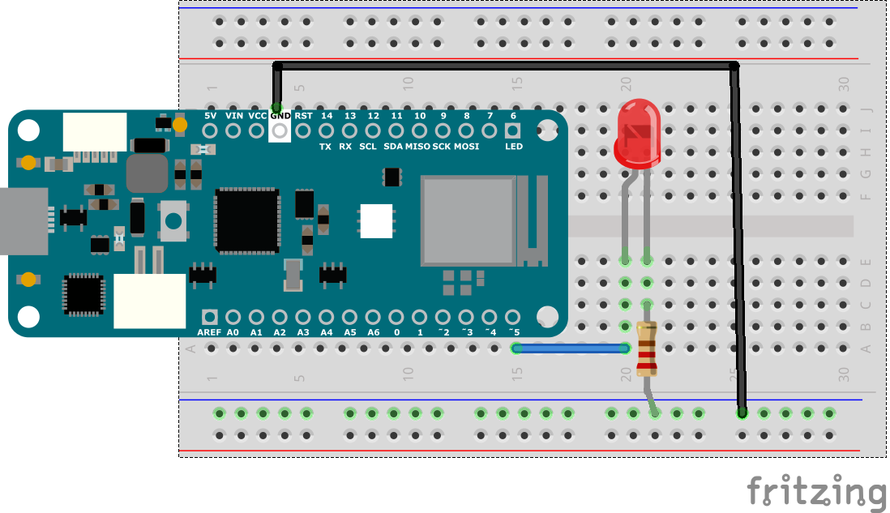
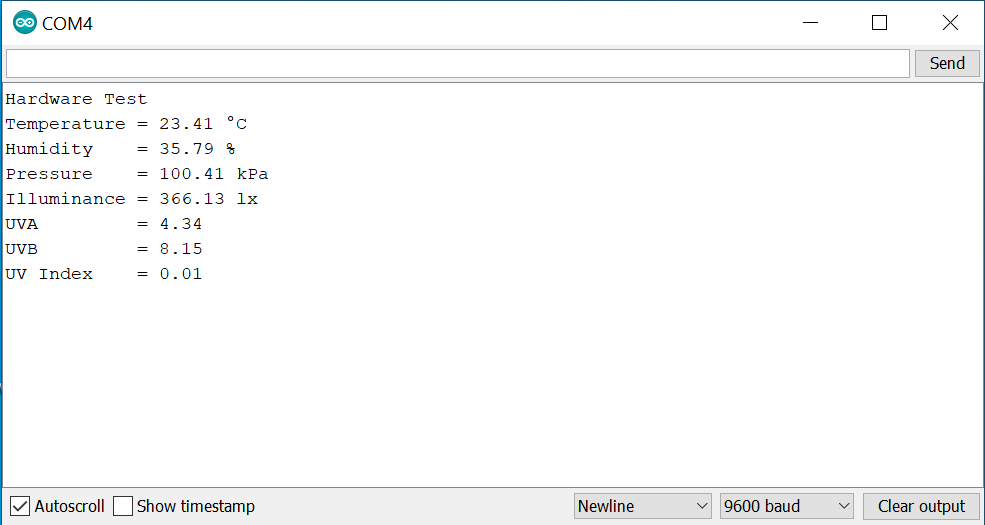
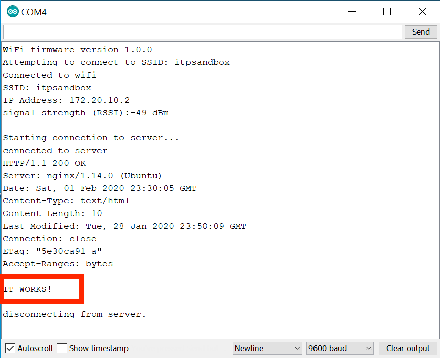

# Exercise 2: Assemble the Hardware

## Wiring

Suggested wiring instructions:

1. Place the solderless breadboard with A1 on the bottom left.
1. Plug the Arduino MKR WiFi 1010 into the breadboard with the AREF pin in C1.
1. Plug the Arduino MKR ENV Shield into the Arudino MRK 1010
1. Plug the LED into E19 and E20. Make sure the longer leg is in E19.
   * Run a 220 &#937; or 330 &#937; resistor from the negative rail to C20
   * Run a blue wire from A14 (pin 5 on the Arduino) to A19 (anode of the LED)
1. Run a black wire from J4 (GND pin on the Arduino) to the negative rail

## Hardware Test

1. Open arduino/HardwareTest/HardwareTest.ino in the Arduino IDE
1. Choose the board _Tools -> Board -> Arduino MKR WiFi 1010_
1. Choose the port _Tools -> Port -> COM 4 (Arduino MKR WiFI 1010)_ Note that the actual port may be different on your computer
1. Upload the code to the board _Sketch -> Upload_
1. The LED should be a solid color
1. Open the serial monitor _Tools -> Serial Monitor_
1. The LED should start blinking and you should see sensor data in the serial console

## Register MAC address with ITP Sandbox Network

If you're using an Arduino from the ER you can skip this step. 

In order to join the `itpsandbox` wireless network, the MAC address of the device must be registered with [NYU-NET](https://computer.registration.nyu.edu/). Use the [MacAddress sketch](../arduino/MacAddress/MacAddress.ino) to get the MAC address for your device. 

[Tom Igoe's documentation](https://itp.nyu.edu/networks/tutorials/itp-network-connections/) has more details about the process.

## Network Test

1. Open arduino/NetworkTest/NetworkTest.ino in the Arduino IDE
1. Edit the ssid and password on the arduino_secrets.h tab
1. Upload the code to the board _Tools -> Upload_
1. Open the serial monitor _Tools -> Serial Monitor_
1. Look for the message "IT WORKS!"

Next [Exercise 3: Sending data using HTTP](exercise3.md)
