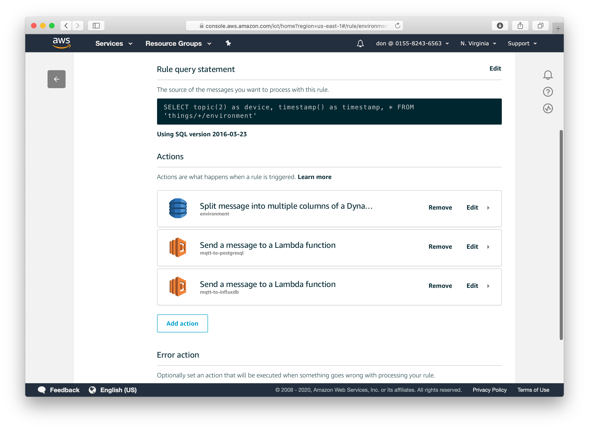
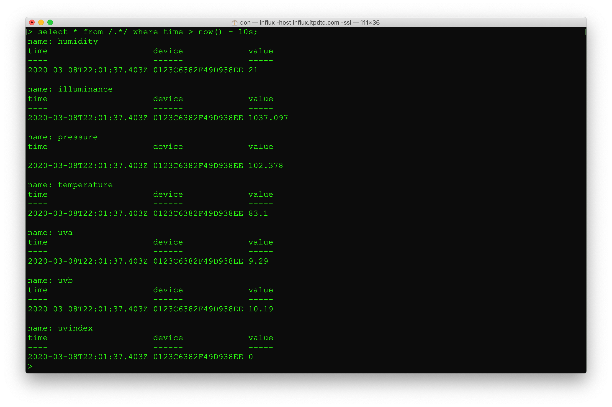

# InfluxDB

In addition to storing data in PostgreSQL, we can also send it to InfluxDB. The CloudFormation script created a 2nd Lambda function `mqtt-to-influxdb`. We need to configure this function to connect to Influx. AWS does not have an InfluxDB service, so we'll use the server from previous weeks, `influx.itpdtd.com`. You won't be able to write to the `itp` database because your user has read-only permissions. However, each user has their own database they can write to. For example Samantha logs into InfluxDB with the password *secret*. Samantha would set INFLUXDB_USER to `samantha`, INFLUXDB_DATABASE to `samantha`, and INFLUXDB_PASSWORD to `secret`. The INFLUX_USER and INFLUX_DATABASE are both set to `samantha` because each user has a database with their name. We don't need to create a schema for InfluxDB. Measurements will be created as data is received.

 * Open the Lambda function `Services -> Lambda`
 * Click on the `mqtt-to-influxdb` function
 * Edit the environment variables
 * Change INFLUXDB_DATABASE to your username
 * Change INFLUXDB_USER to your username
 * Change INFLUXDB_PASSWORD to your password

 ## Test

Configure a test event with the following data and ensure you can insert records into Influx.

     {
        "device": "test",
        "temperature": 72,
        "humidity": 42,
        "timestamp": 0
    }

## Rules

Now that the Lambda function works, we can have the IoT Core send data to it. 

 * From the `Services` menu, choose `IoT Core`. 
 * Choose `Act -> Rules` from the menu on the left. 
 * Select the `environment` rule. 
 * Use the `Add action` button to add a new action. 
 * Choose `Send a message to a Lambda function`.
 * Press `Configure Action` at the bottom of the page.
 * Select `mqtt-to-influxdb`.
 * Press `Add action`.

 

Use the influx cli to verify that data is begin written to the database

    influx -host influx.itpdtd.com -ssl -username samantha -password secret
    use samantha
    precision rfc3339
    select * from /.*/ where time > now() - 10s

Next [Notifications](notifications.md)

