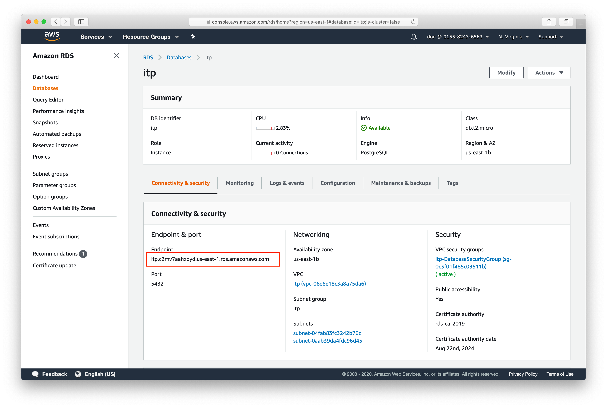

# PostgreSQL

We like to store the sensor data in PostgreSQL. The CloudFormation template created a PostgreSQL database using Amazon Relational Database Service (RDS). 

 * Open the RDS dashboard. Choose `Services -> RDS`.
 * Choose Databases from the left side
 * Click on the `itp` instance to see the details
 * Get the database endpoint

## Create users and schema

Connect to your database as the `postgres` user.

    psql -h itp.c2mv7aahxpyd.us-east-1.rds.amazonaws.com -U postgres -P postgres-123

We set the password for the postgres user in the CloudFormation template.

As the postgres user, create some user accounts. The `sensors` user will own the database. The other accounts are for the lambda function and grafana.

    CREATE USER sensors WITH ENCRYPTED PASSWORD 'lemon.box';
    CREATE USER lambda WITH ENCRYPTED PASSWORD 'hydrogen-5';
    CREATE USER grafana WITH ENCRYPTED PASSWORD 'hat-trick';

Disconnect from psql using `\q`

Reconnect to the database as the `sensors` user.

    psql -h itp.c2mv7aahxpyd.us-east-1.rds.amazonaws.com -U sensors -P lemon.box postgres

Create the `itp` database and connect to it

    CREATE DATABASE itp;
    \c itp

Create the tables

    -- our standard table for sensor data
    CREATE TABLE sensor_data (
        id SERIAL PRIMARY KEY,
        device VARCHAR(50),
        measurement VARCHAR(50),
        reading DOUBLE PRECISION,
        recorded_at TIMESTAMPTZ NOT NULL DEFAULT CURRENT_TIMESTAMP
    );

    -- alternate table structure where each measurement in its own column
    CREATE TABLE environment (
        id SERIAL PRIMARY KEY,
        device VARCHAR(50),
        temperature DOUBLE PRECISION,
        humidity DOUBLE PRECISION,
        pressure DOUBLE PRECISION,
        illuminance DOUBLE PRECISION,
        uva DOUBLE PRECISION,
        uvb DOUBLE PRECISION,
        uvindex DOUBLE PRECISION,
        recorded_at TIMESTAMPTZ NOT NULL DEFAULT CURRENT_TIMESTAMP
    );

Grant the lambda user permission to connect and write to the tables

    GRANT CONNECT ON DATABASE itp TO lambda;
    GRANT USAGE ON ALL SEQUENCES IN SCHEMA public TO lambda;
    GRANT INSERT ON ALL TABLES IN SCHEMA public TO lambda;

Grant the grafana user permission to connect and read from the tables

    GRANT CONNECT ON DATABASE itp TO grafana;
    GRANT SELECT ON ALL TABLES IN SCHEMA public TO grafana;

Disconnect from psql using `\q`

## Lambda

## Rules

## Grafana
